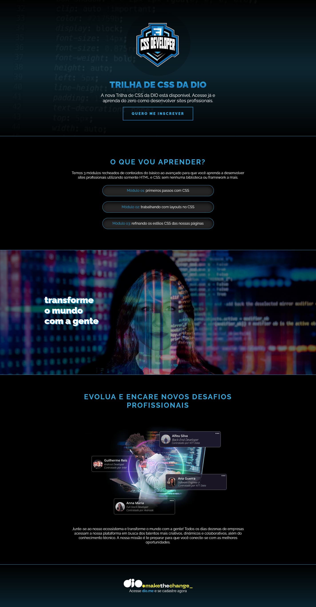

# 👨‍💻 Landing Page | Desafio DIO

## 📃 Descrição

Desafio da *trilha de CSS* do bootcamp **NTT DATA Diversidade em Tech** da **Digital Innovation One (DIO)**.

Neste desafio, foi proposto desenvolver a parte do CSS de uma *Landing Page* sobre a *trilha de CSS da Dio*. Foi utilizado apenas o que foi aprendido durante a trilha de CSS, nos cursos:

* Fundamentos do CSS
* Estilizações Básicas com CSS
* Unidades de Medida

Não foi proposto, mas tomei a liberdade de **deixar o site responsivo**, utilizando os conceitos aprendidos até então no bootcamp, além de utilizar os conhecimentos que já possuo.

O site sem modificações no HTML, simplificado e sem a responsividade está na branch *old*.

## 🖼️ Imagem do site

## 📌 Mais informações

Este desafio faz parte do bootcamp **NTT DATA Diversidade em Tech**, disponível através da **Digital Innovation One (DIO)**. Agradecimentos à **DIO** pelo conteúdo e pela a oportunidade de estar melhorando minhas habilidades cada vez mais, além de estar aprendendo bastante coisa nova e interessante! 😄

## 🔗 Links

* [🔍 DIO.me](https://www.dio.me/)
* [🔍 FIGMA do Projeto](https://www.figma.com/file/AVCNwqCXr3CVcsuDqEjKYQ/DIO---Desafio-01---C%C3%B3pia?node-id=0%3A1)
* [🔍 Repositório Base - Fork](https://github.com/digitalinnovationone/trilha-css-desafio-01)
